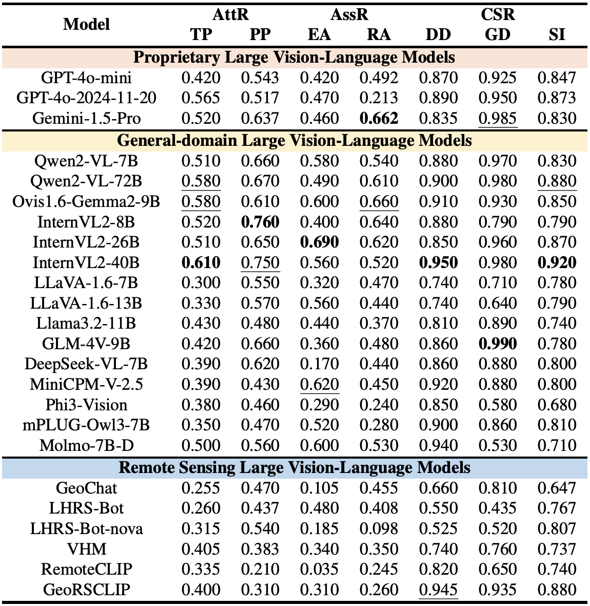

# CHOICE: Benchmarking the Remote Sensing Capabilities of Large Vision-Language Models

[](https://arxiv.org/abs/2411.18145)
[](https://huggingface.co/datasets/An-Xiao/CHOICE)
[](https://www.kaggle.com/datasets/anxiaowhu/choice)

> Due to the capacity limitation of GitHub repositories (which is insufficient to accommodate our **6.07 GB** CHOICE benchmark), we have randomly selected 20 samples for each L-3 task, resulting in a total of 460 samples. These samples are stored in the CHOICE_subset folder, which is structured as [Data Structure](#-data-structure). **For the complete CHOICE benchmark, please refer to the link on [Hugging Face](https://huggingface.co/datasets/An-Xiao/CHOICE) or [Kaggle](https://www.kaggle.com/datasets/anxiaowhu/choice)**.

> We will regularly maintain and update CHOICE and this repository to foster a comprehensive remote sensing community.

---

## 📢 Latest Updates
- **May-13-2025**: We release the code for inference and evaluation.
- **Apr-07-2025**: We release the complete CHOICE benchmark in the [Hugging Face Dataset](https://huggingface.co/datasets/An-Xiao/CHOICE) and [Kaggle](https://www.kaggle.com/datasets/anxiaowhu/choice). 🔥🔥
- **Apr-07-2025**: We update the preprint in the [Arxiv](https://arxiv.org/abs/2411.18145). 🔥🔥
- **Nov-27-2024**: We release the preprint in the Arxiv.

---

## ✨ Overview
<p align="center">
   </a>
</p>
<p align="justify"> <b>Figure</b>: (left) The hierarchical capability taxonomy of CHOICE, which concentrates on perception and reasoning capabilities and is categorized into 6 Level-2 dimensions and 23 Level-3 leaf tasks. (right) Evaluation results of the 6 Level-2 capability dimensions across mainstream VLMs. Each circle is divided into three parts by three gray lines, which, ordered by area from largest to smallest, correspond to general-domain open-source VLMs, RSVLMs, and proprietary VLMs, respectively.

**<p align="justify"> Abstract:** The rapid advancement of Large Vision-Language Models (VLMs), both general-domain models and those specifically tailored for remote sensing, has demonstrated exceptional perception and reasoning capabilities in Earth observation tasks. However, a benchmark for systematically evaluating their capabilities in this domain is still lacking. To bridge this gap, we propose CHOICE, an extensive benchmark designed to objectively evaluate the hierarchical remote sensing capabilities of VLMs. Focusing on 2 primary capability dimensions essential to remote sensing: perception and reasoning, we further categorize 6 secondary dimensions and 23 leaf tasks to ensure a well-rounded assessment coverage. CHOICE guarantees the quality of a total of 10,507 problems through a rigorous process of data collection from 50 globally distributed cities, question construction and quality control. The newly curated data and the format of multiple-choice questions with definitive answers allow for an objective and straightforward performance assessment. Our evaluation of 3 proprietary and 21 open-source VLMs highlights their critical limitations within this specialized context. We hope that CHOICE will serve as a valuable resource and offer deeper insights into the challenges and potential of VLMs in the field of remote sensing.
</p>

## 🏆 Observations

- **RSVLMs excel in tasks trained with specialized remote sensing knowledge, while showing no clear consistent superiority over general-domain VLMs.** The domain gap underlines the necessity of domain-specific data for optimal performance. However, the neglect of integration with general knowledge contributes to the underperformance of RSVLMs.
- **Fine-grained perception and reasoning are key challenges for VLMs.** The perception of fine-grained objects and advanced reasoning tasks involving complex scenes, social attributes and specific remote sensing characteristics pose significant challenges for nearly all evaluated VLMs.
- **Open-source VLMs can serve as viable alternatives to proprietary VLMs.** Cutting-edge VLMs like Qwen2-VL-70B and InternVL2-40B demonstrate competitive or even superior performance in specific tasks compared to GPT-4o.
<hr />

## 🛠️ Evaluation Workflow
> Please refer to [evaluation.md](./evaluation.md).

<hr>

## 📂 Benchmarks Comparison

<p align="center">
   </a>
</p>


<p align="justify"> <b>Table</b>: Comparison of CHOICE with existing datasets & benchmarks. "All-new" shows whether the dataset or benchmark excludes publicly available datasets and is not involved in the training of VLMs. "Dimension" means the number of fine-grained evaluation capabilities. Abbreviations adopted: O for Optical; MI for Multi-Image; V for Video; BT for Bi-Temporal; MT for Multi-Temporal; MCQ for Multi-Choice Question; FF for Free Form; BBox for Bounding Box; Seg for Segmentation Mask.
</p>

### Limitations of Current Datasets or Benchmarks
- **Separate scope.** The prevailing evaluation has long relied on a handful of individual datasets, each targeting only one specific skill.
- **Fragmented benchmarking.** Coarse taxonomy of evaluation dimensions and limited quantity of samples and tasks (especially the absence of pixel-wise and multi-temporal tasks) offer only a fragmented perspective on in-depth hierarchical capabilities.
- **Non-objectivity by Data leakage.** most mainstream datasets or benchmarks in remote sensing are repurposed from common datasets, some of which are engaged in the training stages of VLMs. This recycling of data leads to inevitable data leakage and undermines objectivity during the evaluation process.

<hr />

## ⚙️ Construction of CHOICE
<p align="justify"> Three methods are employed to construct the problems: (1) Label-driven Construction, (2) Foundation Model-driven Construction, and (3) Human-GPT4 Collaboration. Human annotators are further involved to ensure the quality and correctness.
</p>

<p align="center">
   </a>
</p>

<p align="justify"> <b>Figure</b>: Overview of the construction of CHOICE. All RSIs, sourced around the world, are collected from various satellites, products, and platforms. There are three approaches to generating the problems and a human-involved quality control process guarantees the accuracy of all the questions.
</p>

<hr />

## 📊 Results

Currently, general-domain VLMs, benefiting from extensive training corpora, exhibit a broader range of capabilities, even outperforming RSVLMs in certain abilities pertinent to remote sensing. However, none of the VLMs achieve consistently high performance across the 6 capability dimensions of CHOICE, highlighting substantial room for improvement in tackling complex remote sensing tasks.

<table style="width: 100%; table-layout: fixed;">
<tr>

<td style="vertical-align: top; width: 47%; height: 100%;">
<p align="center">
   
</p>
<p align="justify"> <b>Table</b>: Evaluation results for L-2 dimensions. Abbreviations adopted: ILC for Image-level Comprehension; SII for Single-instance Identification; CID for Cross-instance Discernment; AttR for Attribute Reasoning; AssR for Assessment Reasoning; CSR for common sense Reasoning. The best (second best) is in bold (underline).</p>
</td>

<td style="vertical-align: top; width: 51.5%; height: 100%;">
<p align="center">
   
</p>
<p align="justify"> <b>Table</b>: Fine-grained evaluation results for Reasoning. Abbreviations adopted: TP for Time Property; PP for Physical Property; EA for Environmental Assessment; RA for Resource Assessment; DD for Disaster Discrimination; GD for Geospatial Determination; SI for Situation Inference. The best (second best) is in bold (underline).</p>
</td>

</tr>
</table>

<p align="center">
   </a>
</p>

<p align="justify"> <b>Table</b>: Fine-grained evaluation results for Perception. Abbreviations adopted: IM for Image Modality; IQ for Image Quality; MR for Map Recognition; SC for Scene Classification; IC for Image Caption; LR for Landmark Recognition; OC for Object Counting; OL for Object Localization; OP for Object Presence; AR for Attribute Recognition; VG for Visual Grounding; HD for Hallucination Detection; AC for Attribute Comparison; SR for Spatial Relationship; CD for Change Detection. The best (second best) is in bold (underline).
</p>

<hr />

## 📂 Data Structure

<a id="-data-structure"></a>

CHOICE_subset is organized according to the three-tier hierarchical dimension taxonomy, structured as follows:

```bash
perception
├── cross_instance_discerment
│   ├── attribute_comparison
│   │   ├── images
│   │   └── attribute_comparison.json
│   ├── change_detection
│   │   ├── images
│   │   └── change_detection.json
│   ├── referring_expression_segmentation
│   │   ├── images
│   │   ├── masks
│   │   └── referring_expression_segmentation.json
│   └── spatial_relationship
│       ├── images
│       └── spatial_relationship.json
├── image_level_comprehension
│   ├── image_caption
│   │   ├── images
│   │   └── image_caption.json
│   ├── image_modality
│   │   ├── images
│   │   └── image_modality.json
│   ├── image_quality
│   │   ├── images
│   │   └── image_quality.json
│   ├── map_recognition
│   │   ├── images
│   │   └── map_recognition.json
│   └── scene_classification
│       ├── images
│       └── scene_classification.json
└── single_instance_identification
    ├── ......

reasoning
├── assessment_reasoning
│   ├── environmental_assessment
│   │   ├── images
│   │   └── environmental_assessment.json
│   └── resource_assessment
│       ├── images
│       └── resource_assessment.json
├── ......

```

<hr />

# 📜 Acknowledgements

We gratefully acknowledge the following data sources and platforms that made this project possible:

- **Google Earth** for high-resolution satellite imagery.  
- **Google Earth Engine (GEE)** for planetary-scale geospatial data access and processing tools.
- **Sentinel** satellite data, provided by the European Space Agency (ESA) via the Copernicus Open Access Hub.  
- **Landsat** satellite data, provided by the U.S. Geological Survey (USGS).
- **OpenStreetMap (OSM)** data, contributed by a global community of volunteers and accessed through various mapping services and APIs.

> Use of the Google Earth images must respect the [Google Earth terms of use](https://about.google/brand-resource-center/products-and-services/geo-guidelines/#google-earth). All images and their associated annotations in CHOICE can be used for academic purpose only, any commercial use is prohibited.
